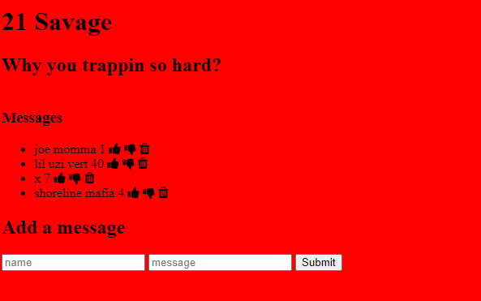

# Savage-Demo

In this project users can post comments and delete comments and interact with other cmments like either liking or disliking each comment.

&emsp;

## How Its Made 
**Languages used:** Html, CSS, Javascript, Node.js ,MongoDB , Express
# What I Learned
I learned how to save user data in the back end and retrieve that data to show multiple users on the site by adding a live comment section. 
### My Other Projects 
Check out some of my other work using the DOM!
* [JDM Express](https://github.com/BrianMelaraDev/jdmPersonalExpress/blob/main/README.md)
* [Uzi Tracker](https://github.com/BrianMelaraDev/lilUziTracker)
